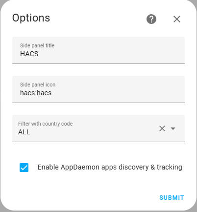
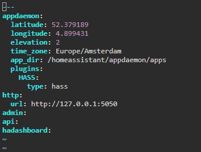
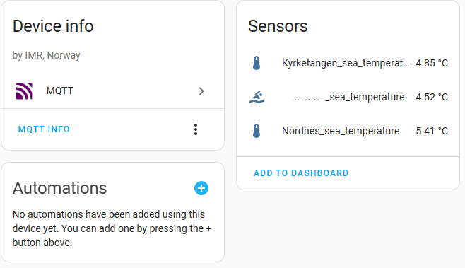
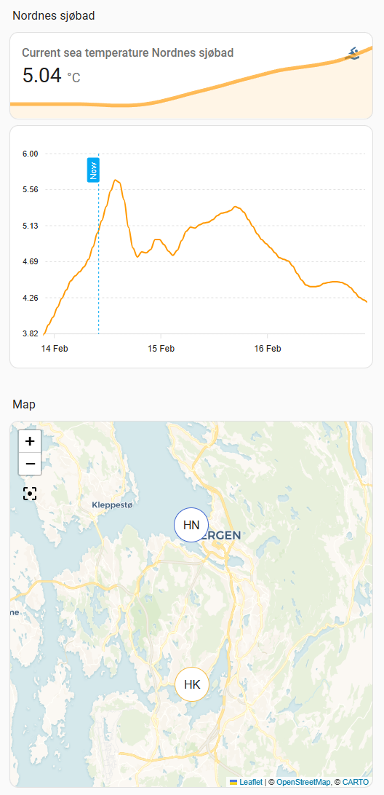
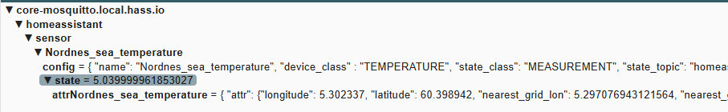

Navigate to: [My smart home](https://github.com/jm-cook/my-smart-home/tree/main)

[](https://github.com/jm-cook/ha-havvarsel)
[](https://github.com/jm-cook/ha-havvarsel/actions/workflows/validate.yaml)
[](https://github.com/jm-cook/ha-havvarsel/releases)


# HA Havvarsel
HA Havvarsel is an AppDaemon app which will provide current sea temperature model data and prognosis from the Norwegian Institute for Marine Research 
(Havforskningsinstituttet).

This standalone python app for AppDaemon will create a sensor for the sea temperature at 
the specified location. 
To use it you will use the Home Assistant addons appdaemon and mqtt and install this python app
for appdaemon. This method may initially seem 
complicated but installation *should* be straightforward and the solution gives the best results out of all the methods that I tried.

## Installation

To install the codes you must follow these steps:

1. install the mosquitto broker add on for home assistant. To do this go to the add-ons configuration section and select the mosquitto broker from the list of official addons.

   [](https://my.home-assistant.io/redirect/supervisor_store/)

   Install mosquitto and configure it.

3. You will need the MQTT integration from the integrations page:
   
   [](https://my.home-assistant.io/redirect/config_flow_start/?domain=mqtt)

4. Now install the appdaemon addon which is available from the addon store.

   [](https://my.home-assistant.io/redirect/supervisor_store/)

-----------------------------------------
The script "havvarsel.py" is an app for AppDaemon that periodically fetches the current sea temperature
for the specified location. A sensor is created by posting to a *create* topic on the MQTT server. The data is updated 
by posting to a topic that was specified in the *create* payload. The payloads are constructed so that your Home Assistant
instance will auto-discover the sensor, and it will be available for display.

## Installation with HACS

If you are using HACS, this may be the best method for you, but using HACS with 
appdaemon may be a bit easier with the following pre-requisites:

1. In settings for the HACS integration, enable appdaemon discovery:

    

2. In your appdaemon configuration make the following change:
   - Point appdaemon to use the same folder that HACS downloads apps to, instead of the default used by appdaemon. 
     Be aware though that when creating a backup, your appdaemon apps will then be backed up with home assistant and not with appdaemon.
   - in a terminal window `cd /addon_configs/a0d7b954_appdaemon/`
   - edit `appdaemon.yaml` to include `app_dir: /homeassistant/appdaemon/apps`

      
   - be sure to move any existing apps and `apps.yaml` into the Home Assistant folder `/homeassistant/appdaemon/apps`
   - Restart appdaemon, now you're all set to use appdaemon and HACS in harmony.

Once you have carried out the pre-requisites you can install and later upgrade ha havvarsel in HACS.

Add HA Havvarsel as a custom appdaemon repository by adding the github repository https://github.com/jm-cook/ha-havvarsel
to your HACS configuration (3-dot-menu -> custom repositories).

Now you can open HACS on your system and search for "havvarsel", click on download to add it to your system and 
configure apps.yaml using the instructions below.

## Manual installation

Copy the files in the folder ```apps/havvarsel``` to your appdaemon app folder. It will probably be in something like: ```/addon_configs/a0d7b954_appdaemon/apps```, you can copy the whole folder and contents
You will need to upload the file yourself, or copy/paste using an editor.

## Configure apps.yaml

Then configure the app in the ```apps.yml``` file located in the AppDaemon apps folder. Similar to the following:

```yaml
havvarsel_nordnes:
  module: havvarsel
  class: HavvarselRest
  log_level: INFO
  device: Havvarsel
  manufacturer: IMR, Norway
  longitude: 5.302337
  latitude: 60.398942
  sensor_name: Nordnes sea temperature
  unit_of_measurement: °C
```

 - ```module```, and ```class``` are mandatory and must be written as shown
 - ```log_level``` can be INFO or DEBUG and is optional
 - ```device``` is the name your HA device wil get
 - ```manufacturer``` is optional and displayed for the device to show the data provider
 - ```longitude``` and ```latitude``` are the location on the Norwegian coast where you want the forecast from
 - ```sensor_name``` will be the name of the sensor in your instance
 - ```unit_of_measurement``` is optional and overrides the units provided by the underlying rest service.
 
 When you save the ```app.yaml``` file in your configuration, AppDaemon will start the havvarsel app. You can add several configurations 
 for different locations if you want more sensors.

For example to add a new location include the following, or similar, in addition to the above configuration:

```yaml
havvarsel_kyrketangen:
  module: havvarsel
  class: HavvarselRest
  log_level: INFO
  device: Havvarsel
  manufacturer: IMR, Norway
  longitude: 5.302686
  latitude: 60.324667
  sensor_name: Kyrketangen sea temperature
  unit_of_measurement: °C
```

Note that the app script specifies that MQTT topics should be retained. This is to ensure continuity between restarts
of HA (otherwise the sensors become unavailable). MQTT retention can be tricky, and if something goes wrong, or you want to remove a sensor, then 
it will most likely be retained. This may mean that old sensors are still available after you have 
removed them from the configuration. There is currently no automatic purge to remove previous configurations (but see below).

Once the app is upp and running you can go to the settings page for the MQTT integration where you should see similar to the
following screenshot:



You can access and edit the sensors from here if you want to change the icon or the number of decimals to show.

## Use

The sensors created show the forecasted temperature at each location. The sensor includes the position of the 
forecast, which means they can also be shown in HA on a map. The sensor includes the whole forecast 
as an attribute giving the possibility to plot the forecast. 

### Example view configuration




The example view shown here is configured using the yaml code below. To plot future 
values from the forecast attribute, the custom apex charts card must be installed (https://github.com/RomRider/apexcharts-card)

```yaml
views:
  - type: sections
    max_columns: 2
    title: Sea temperature demo
    path: sea-temperature-demo
    sections:
      - type: grid
        cards:
          - type: heading
            heading: Nordnes sjøbad
            heading_style: title
          - graph: line
            type: sensor
            entity: sensor.havvarsel_nordnes_sea_temperature
            detail: 1
            icon: mdi:swim
            grid_options:
              columns: full
            name: Current sea temperature Nordnes sjøbad
          - type: vertical-stack
            cards:
              - type: custom:apexcharts-card
                experimental:
                  disable_config_validation: true
                grid_options:
                  columns: full
                  rows: 4
                graph_span: 72h
                span:
                  offset: +60h
                now:
                  show: true
                  label: Now
                header:
                  show: true
                  show_states: true
                series:
                  - entity: sensor.havvarsel_nordnes_sea_temperature
                    name: Temperature forecast
                    stroke_width: 2
                    decimals: 2
                    show:
                      in_header: false
                      legend_value: false
                    data_generator: |
                      return entity.attributes.forecast.map((entry) => {
                        return [new Date(entry.timestamp).getTime(), entry.temperature];
                      });
      - type: grid
        cards:
          - type: heading
            heading: Map
            heading_style: title
          - type: map
            entities:
              - entity: sensor.havvarsel_nordnes_sea_temperature
              - entity: sensor.havvarsel_kyrketangen_sea_temperature
            theme_mode: auto
            grid_options:
              columns: full
              rows: 8
```

------------------------------------------
If you should use a configuration that created a  sensor that you no longer need, the sensor will continue to exist even if you remove it from the configuration. This is due to
message retention in the mosquitto broker. The current method to remove unwanted sensor is to access the mosquitto broker using MQTT Explorer (take a look here https://community.home-assistant.io/t/addon-mqtt-explorer-new-version/603739). If you connect MQTT Explorer to your broker, you can delete the unwanted topics there:


